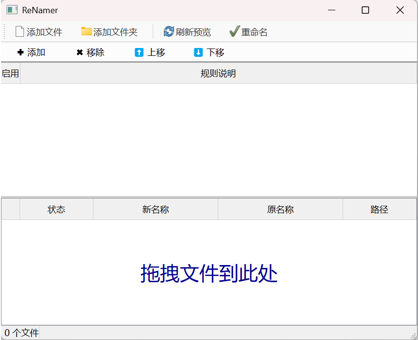

<!-- more -->
# Hello 朋友们！

今天带来一个实用的工具——**Renamer**

仓库链接

[](https://github.com/lyc-28/Renamer)

下面是本程序的使用教程（下方附有源码）：

# ReNamer 批量重命名工具 - 使用说明书

**ReNamer** 是一款轻量级、功能强大的文件批量重命名工具。它采用“模块化规则”的设计理念，允许用户通过组合不同的处理规则（如插入、删除、替换、序列化等），对大量文件进行快速、安全的改名操作。

---

## 目录
1. [界面概览](#1-界面概览)
2. [快速开始](#2-快速开始操作流程)
3. [规则详解](#3-规则详解)
4. [高级功能与技巧](#4-高级功能与技巧)
5. [常见问题与注意事项](#5-常见问题与注意事项)

---

## 1. 界面概览



软件主界面分为上下两个主要区域，由中间的分隔条隔开（可上下拖动调整高度）：

*   **顶部工具栏**：包含添加文件、刷新预览、执行重命名等常用功能按钮。
*   **上半部分（规则区）**：显示当前设定的所有重命名规则。
    *   支持添加、移除、上下移动规则。
    *   规则从上到下依次执行。
*   **下半部分（文件区）**：显示待处理的文件列表。
    *   **状态**：显示文件当前的情况（OK、冲突、已存在等）。
    *   **新名称**：实时预览应用规则后的文件名（蓝色表示有变化，红色表示有错误）。
    *   **原名称/路径**：文件的原始信息。
*   **底部状态栏**：显示当前加载的文件总数。

---

## 2. 快速开始（操作流程）

只需简单的四步即可完成批量重命名：

### 第一步：导入文件
有两种方式将文件添加到软件中：
1.  **点击按钮**：点击工具栏左侧的 **📄 添加文件** 或 **📂 添加文件夹** 图标。
2.  **拖拽操作**：直接从文件夹中选中多个文件，拖入软件下方的“文件列表”区域（空白处显示“拖拽文件到此处”）。

### 第二步：添加规则
点击规则区（上半部分）左上角的 **✚ 添加** 按钮，弹出规则配置窗口。
1.  在左侧列表选择规则类型（如：插入、替换、序列化等）。
2.  在右侧设置具体参数。
3.  点击 **➕ 添加** 确认。
    *   *注：您可以添加多条规则，软件会按顺序依次处理。*

### 第三步：预览与检查
添加规则后，下方的文件列表会自动刷新：
*   观察 **“新名称”** 列：这是改名后的预期结果。
*   **蓝色文字**：表示文件名将发生改变。
*   **黑色文字**：表示文件名未发生变化（规则未命中）。
*   **红色文字/状态**：
    *   `冲突`：表示多个文件改名后变成了同一个名字。
    *   `已存在`：表示目标文件夹里已经有一个同名文件。
    *   *注意：如果有红色状态，请修改规则直到变为正常，否则无法执行。*

### 第三步：执行重命名
确认预览无误后，点击工具栏最右侧的 **✅ 重命名** 按钮。
*   系统会弹窗提示成功重命名的文件数量。
*   完成后，列表中的“原名称”会自动更新为最新名称。

---

## 3. 规则详解

软件内置了 7 种核心规则，灵活组合可满足绝大多数需求。

### 3.1 插入 (Insert)
在文件名的指定位置加入文字。
*   **位置**：
    *   `前缀`：加在文件名的最开头。
    *   `后缀`：加在文件名的末尾（扩展名之前）。
    *   `指定位置`：从第 N 个字符后插入。
*   **忽略扩展名**：勾选后，后缀和位置计算不包含 `.jpg` 等后缀。

### 3.2 删除 (Delete)
删除文件名中指定区间的字符。
*   **起始位置**：从第几个字符开始删（1 代表第 1 个字）。
*   **删除字符数**：向后删除多少个字。
*   **直到末尾**：勾选后，从起始位置一直删到最后。

### 3.3 移除 (Remove)
删除特定的文字内容。
*   **移除文本**：输入你想删掉的词（例如 "副本"）。
*   **模式**：
    *   `全部`：删掉出现的所有该词。
    *   `首个`：只删掉出现的第一次。
    *   `末个`：只删掉出现的最后一次。

### 3.4 替换 (Replace)
将一段文字变成另一段文字。
*   **查找**：要被换掉的旧文字。
*   **替换为**：新的文字（留空则等同于删除）。
*   **高级选项**：
    *   `正则表达式`：支持 Regex 语法（适合高级用户）。
    *   `区分大小写`：勾选后 `A` 和 `a` 会被视为不同字符。

### 3.5 大小写 (Case)
快速修改字母的大小写格式。
*   `全部小写`：ABC -> abc
*   `全部大写`：abc -> ABC
*   `首字母大写`：hello world -> Hello world
*   `每个单词首字母大写`：hello world -> Hello World
*   `反转大小写`：aBc -> AbC

### 3.6 序列化 (Serialize)
给文件添加数字编号（如 001, 002）。
*   **起始**：第一个文件从几号开始（默认 1）。
*   **增量**：每次增加多少（默认 1）。
*   **填充位数**：数字的长度（补零）。
    *   设为 `1` -> 1, 2, ..., 10
    *   设为 `3` -> 001, 002, ..., 010
*   **位置**：添加到文件名的开头或结尾。

### 3.7 扩展名 (Extension)
专门处理文件的后缀名。
*   `改为小写`：.JPG -> .jpg
*   `改为大写`：.jpg -> .JPG
*   `移除扩展名`：慎用，文件可能无法打开。
*   `更改为`：输入新的后缀（例如把 png 改为 jpg）。

---

## 4. 高级功能与技巧

### 调整规则顺序
规则的执行是有顺序的！
*   例如：先“插入前缀”，再“全部大写”，前缀也会变成大写。
*   **操作**：在规则列表中选中一条规则，点击上方的 **⬆ 上移** 或 **⬇ 下移** 按钮；或者**直接用鼠标拖拽**规则行来改变顺序。

### 临时禁用规则
如果您想暂时不使用某条规则，但不想删除它：
*   在规则列表中，**取消勾选**该规则前的复选框。预览结果会立即更新。

### 跳过特定文件
如果您导入了 10 个文件，但只想改其中 8 个：
*   在下方文件列表中，**取消勾选**不想处理的文件。这些文件的状态会变为灰色“跳过”，重命名时不会受影响。

### 忽略扩展名 (重要)
大多数规则（插入、删除、替换等）底部都有一个 **“忽略扩展名”** 的复选框（默认勾选）。
*   **勾选时**：操作只针对文件名主体（如 `photo`），`.jpg` 保持不变。
*   **不勾选时**：操作针对完整文件名（如 `photo.jpg`）。如果您想把 `.jpg` 替换成 `.png`，请取消勾选此项，或者直接使用“扩展名”规则。

---

## 5. 常见问题与注意事项

**Q: 为什么文件名变成了红色？**
A: 这表示出现了错误。
*   **冲突**：当前规则导致两个不同的文件改名后名字一模一样，系统无法处理。
*   **已存在**：改名后的名字与文件夹里现有的其他文件重名。
*   **解决方法**：添加一条“序列化”规则，或者修改现有规则，确保每个文件名唯一。

**Q: 重命名后可以撤销吗？**
A: **不可以**。文件重命名是直接对系统文件进行操作，无法通过软件内的一键撤销恢复。建议在批量操作重要文件前，先拿少量文件进行测试。

**Q: 只有部分文件想改名怎么办？**
A: 可以在文件列表中取消勾选不需要改名的文件。

**Q: 如何清空所有规则？**
A: 选中规则并点击“移除”，或者直接重启软件。

**仓库链接**

[](https://github.com/lyc-28/Renamer)

那么，本次分享就到此结束了。

如果在使用过程中发现有BUG请在评论区指出，期待看到你的建议与反馈！

下面，源码展示环节！！！

```python
import sys
import os
import re
from typing import List, Dict, Any

from PyQt5.QtWidgets import (
    QApplication, QMainWindow, QWidget, QVBoxLayout, QHBoxLayout,
    QTableWidget, QTableWidgetItem, QHeaderView, QPushButton, QToolBar,
    QSplitter, QFileDialog, QMessageBox, QDialog, QLineEdit, QLabel,
    QFormLayout, QCheckBox, QListWidget, QStackedWidget, QGroupBox,
    QRadioButton, QSpinBox, QButtonGroup, QStyle, QAbstractItemView, QFrame
)
from PyQt5.QtCore import Qt, QSize
from PyQt5.QtGui import (
    QFont, QColor, QPainter, QDragEnterEvent, QDragMoveEvent,
    QDropEvent
)

# ==========================================
# 1. 样式表 (保持经典风格)
# ==========================================
STYLESHEET = """
QWidget {
    font-family: "Microsoft YaHei", "Segoe UI";
    font-size: 9pt;
    color: #000000;
}
QMainWindow {
    background-color: #f0f0f0;
}
QToolBar {
    background-color: #f9f9f9;
    border-bottom: 1px solid #c0c0c0;
    spacing: 5px;
    padding: 4px;
}
QToolButton {
    background-color: transparent;
    border: 1px solid transparent;
    border-radius: 2px;
    padding: 3px 8px;
    color: #333;
    font-weight: normal;
}
QToolButton:hover {
    background-color: #e5f3ff;
    border: 1px solid #cce8ff;
}
QTableWidget {
    background-color: #ffffff;
    border: 1px solid #828790;
    gridline-color: #e0e0e0;
    selection-background-color: #3399ff;
    selection-color: white;
}
QHeaderView::section {
    background-color: #f0f0f0;
    padding: 3px;
    border: 1px solid #d0d0d0;
    border-left: none;
    border-top: none;
    font-weight: normal;
}
QSplitter::handle {
    background-color: #d0d0d0;
    height: 3px;
}
QFrame#RuleBar {
    background-color: #fcfcfc;
    border-bottom: 1px solid #a0a0a0;
}
QStatusBar {
    background-color: #f0f0f0;
    border-top: 1px solid #c0c0c0;
}
"""


# ==========================================
# 2. 规则逻辑组件
# ==========================================
class BaseRuleWidget(QWidget):
    def __init__(self):
        super().__init__()
        self.layout = QVBoxLayout(self)
        self.layout.setContentsMargins(10, 10, 10, 10)
        self.setup_ui()
        self.layout.addStretch()

    def setup_ui(self):
        pass

    def get_config(self) -> Dict[str, Any]:
        return {}


class InsertRuleWidget(BaseRuleWidget):
    def setup_ui(self):
        form = QFormLayout()
        self.txt = QLineEdit()
        form.addRow("插入内容:", self.txt)
        self.layout.addLayout(form)

        gb = QGroupBox("位置")
        vbox = QVBoxLayout()
        self.bg = QButtonGroup(self)

        self.rb1 = QRadioButton("前缀 (开头)")
        self.bg.addButton(self.rb1, 0)

        self.rb2 = QRadioButton("后缀 (末尾)")
        self.bg.addButton(self.rb2, 1)

        self.rb3 = QRadioButton("指定位置")
        self.bg.addButton(self.rb3, 2)

        self.spin = QSpinBox()
        self.spin.setEnabled(False)
        self.rb3.toggled.connect(self.spin.setEnabled)
        self.rb1.setChecked(True)

        h = QHBoxLayout()
        h.addWidget(self.rb3)
        h.addWidget(self.spin)

        vbox.addWidget(self.rb1)
        vbox.addWidget(self.rb2)
        vbox.addLayout(h)

        gb.setLayout(vbox)
        self.layout.addWidget(gb)

        self.chk = QCheckBox("忽略扩展名")
        self.chk.setChecked(True)
        self.layout.addWidget(self.chk)

    def get_config(self) -> Dict[str, Any]:
        m = "prefix"
        if self.bg.checkedId() == 1:
            m = "suffix"
        elif self.bg.checkedId() == 2:
            m = "pos"
        return {
            'type': 'Insert',
            'text': self.txt.text(),
            'mode': m,
            'pos': self.spin.value(),
            'ign': self.chk.isChecked(),
            'desc': f"插入 '{self.txt.text()}'"
        }


class DeleteRuleWidget(BaseRuleWidget):
    def setup_ui(self):
        form = QFormLayout()
        self.s = QSpinBox()
        self.s.setRange(1, 9999)
        self.c = QSpinBox()
        self.c.setRange(1, 9999)
        self.e = QCheckBox("直到末尾")
        self.e.toggled.connect(lambda x: self.c.setDisabled(x))

        form.addRow("起始位置:", self.s)
        form.addRow("删除字符数:", self.c)
        form.addRow("", self.e)

        self.layout.addLayout(form)
        self.chk = QCheckBox("忽略扩展名")
        self.chk.setChecked(True)
        self.layout.addWidget(self.chk)

    def get_config(self) -> Dict[str, Any]:
        desc = f"删除 位置 {self.s.value()} " + ("直到末尾" if self.e.isChecked() else f"共 {self.c.value()} 个")
        return {
            'type': 'Delete',
            'start': self.s.value(),
            'count': self.c.value(),
            'end': self.e.isChecked(),
            'ign': self.chk.isChecked(),
            'desc': desc
        }


class RemoveRuleWidget(BaseRuleWidget):
    def setup_ui(self):
        form = QFormLayout()
        self.txt = QLineEdit()
        form.addRow("移除文本:", self.txt)
        self.layout.addLayout(form)

        self.bg = QButtonGroup(self)
        self.rb1 = QRadioButton("全部")
        self.rb1.setChecked(True)
        self.bg.addButton(self.rb1, 0)

        self.rb2 = QRadioButton("首个")
        self.bg.addButton(self.rb2, 1)

        self.rb3 = QRadioButton("末个")
        self.bg.addButton(self.rb3, 2)

        h = QHBoxLayout()
        h.addWidget(self.rb1)
        h.addWidget(self.rb2)
        h.addWidget(self.rb3)
        self.layout.addLayout(h)

        self.chk = QCheckBox("忽略扩展名")
        self.chk.setChecked(True)
        self.layout.addWidget(self.chk)

    def get_config(self) -> Dict[str, Any]:
        m = ['all', 'first', 'last'][self.bg.checkedId()]
        return {
            'type': 'Remove',
            'text': self.txt.text(),
            'mode': m,
            'ign': self.chk.isChecked(),
            'desc': f"移除 '{self.txt.text()}'"
        }


class ReplaceRuleWidget(BaseRuleWidget):
    def setup_ui(self):
        form = QFormLayout()
        self.f = QLineEdit()
        self.r = QLineEdit()
        form.addRow("查找:", self.f)
        form.addRow("替换为:", self.r)
        self.layout.addLayout(form)

        self.regex = QCheckBox("正则表达式")
        self.case = QCheckBox("区分大小写")
        self.layout.addWidget(self.regex)
        self.layout.addWidget(self.case)

        self.chk = QCheckBox("忽略扩展名")
        self.chk.setChecked(True)
        self.layout.addWidget(self.chk)

    def get_config(self) -> Dict[str, Any]:
        return {
            'type': 'Replace',
            'find': self.f.text(),
            'rep': self.r.text(),
            'reg': self.regex.isChecked(),
            'case': self.case.isChecked(),
            'ign': self.chk.isChecked(),
            'desc': f"替换 '{self.f.text()}' -> '{self.r.text()}'"
        }


class CaseRuleWidget(BaseRuleWidget):
    def setup_ui(self):
        self.bg = QButtonGroup(self)
        opts = ["全部小写", "全部大写", "首字母大写", "每个单词首字母大写", "反转大小写"]
        for i, t in enumerate(opts):
            r = QRadioButton(t)
            if i == 0:
                r.setChecked(True)
            self.bg.addButton(r, i)
            self.layout.addWidget(r)

        self.chk = QCheckBox("忽略扩展名")
        self.chk.setChecked(True)
        self.layout.addWidget(self.chk)

    def get_config(self) -> Dict[str, Any]:
        m = ['lower', 'upper', 'cap', 'title', 'swap'][self.bg.checkedId()]
        return {
            'type': 'Case',
            'mode': m,
            'ign': self.chk.isChecked(),
            'desc': f"大小写: {m}"
        }


class SerializeRuleWidget(BaseRuleWidget):
    def setup_ui(self):
        form = QFormLayout()
        self.idx = QSpinBox()
        self.idx.setRange(0, 99999)
        self.idx.setValue(1)
        self.stp = QSpinBox()
        self.stp.setValue(1)
        self.pad = QSpinBox()
        self.pad.setValue(1)
        form.addRow("起始:", self.idx)
        form.addRow("增量:", self.stp)
        form.addRow("填充位数:", self.pad)
        self.layout.addLayout(form)

        self.bg = QButtonGroup(self)
        self.rb1 = QRadioButton("后缀")
        self.rb1.setChecked(True)
        self.bg.addButton(self.rb1, 0)

        self.rb2 = QRadioButton("前缀")
        self.bg.addButton(self.rb2, 1)

        h = QHBoxLayout()
        h.addWidget(self.rb1)
        h.addWidget(self.rb2)
        self.layout.addLayout(h)

        self.chk = QCheckBox("忽略扩展名")
        self.chk.setChecked(True)
        self.layout.addWidget(self.chk)

    def get_config(self) -> Dict[str, Any]:
        return {
            'type': 'Serialize',
            'idx': self.idx.value(),
            'stp': self.stp.value(),
            'pad': self.pad.value(),
            'loc': 'end' if self.bg.checkedId() == 0 else 'start',
            'ign': self.chk.isChecked(),
            'desc': "添加序列号"
        }


class ExtRuleWidget(BaseRuleWidget):
    def setup_ui(self):
        self.bg = QButtonGroup(self)

        self.rb1 = QRadioButton("改为小写")
        self.rb1.setChecked(True)
        self.bg.addButton(self.rb1, 0)

        self.rb2 = QRadioButton("改为大写")
        self.bg.addButton(self.rb2, 1)

        self.rb3 = QRadioButton("移除扩展名")
        self.bg.addButton(self.rb3, 2)

        self.layout.addWidget(self.rb1)
        self.layout.addWidget(self.rb2)
        self.layout.addWidget(self.rb3)

        form = QFormLayout()
        self.new_ext = QLineEdit()
        self.new_ext.setPlaceholderText("例如: jpg")

        self.rb4 = QRadioButton("更改为:")
        self.bg.addButton(self.rb4, 3)
        self.rb4.toggled.connect(self.new_ext.setEnabled)
        self.new_ext.setEnabled(False)

        form.addRow(self.rb4, self.new_ext)
        self.layout.addLayout(form)

    def get_config(self) -> Dict[str, Any]:
        id = self.bg.checkedId()
        m = ['lower', 'upper', 'remove', 'change'][id]
        desc = "扩展名: " + ["小写", "大写", "移除", f"改为 {self.new_ext.text()}"][id]
        return {'type': 'Ext', 'mode': m, 'new': self.new_ext.text(), 'desc': desc}


class AddRuleDialog(QDialog):
    def __init__(self, parent=None):
        super().__init__(parent)
        self.setWindowTitle("添加规则")
        self.resize(550, 350)
        layout = QHBoxLayout(self)

        self.list = QListWidget()
        self.list.addItems(["插入", "删除", "移除", "替换", "大小写", "序列化", "扩展名"])
        self.list.setFixedWidth(120)

        self.stack = QStackedWidget()
        self.widgets = [
            InsertRuleWidget(), DeleteRuleWidget(), RemoveRuleWidget(),
            ReplaceRuleWidget(), CaseRuleWidget(), SerializeRuleWidget(), ExtRuleWidget()
        ]
        for w in self.widgets:
            self.stack.addWidget(w)

        self.list.currentRowChanged.connect(self.stack.setCurrentIndex)

        right_w = QWidget()
        r_layout = QVBoxLayout(right_w)
        r_layout.addWidget(QLabel("配置:"))
        r_layout.addWidget(self.stack)

        btns = QHBoxLayout()
        b_ok = QPushButton("➕ 添加")
        b_ok.clicked.connect(self.accept)
        b_no = QPushButton("取消")
        b_no.clicked.connect(self.reject)

        btns.addStretch()
        btns.addWidget(b_ok)
        btns.addWidget(b_no)
        r_layout.addLayout(btns)

        layout.addWidget(self.list)
        layout.addWidget(right_w)
        self.list.setCurrentRow(0)

    def get_rule(self) -> Dict[str, Any]:
        return self.stack.currentWidget().get_config()


# ==========================================
# 3. 表格组件 (支持拖拽)
# ==========================================
class RuleTable(QTableWidget):
    def __init__(self, parent):
        super().__init__(parent)
        self.setColumnCount(2)
        self.setHorizontalHeaderLabels(["启用", "规则说明"])
        self.horizontalHeader().setStretchLastSection(True)
        self.setColumnWidth(0, 40)
        self.verticalHeader().setVisible(True)
        self.verticalHeader().setDefaultSectionSize(24)
        self.setShowGrid(False)
        self.setStyleSheet("border: none; border-top: 1px solid #a0a0a0;")
        self.setSelectionBehavior(QAbstractItemView.SelectRows)
        self.setSelectionMode(QAbstractItemView.SingleSelection)
        self.setDragEnabled(True)
        self.setAcceptDrops(True)
        self.setDragDropMode(QAbstractItemView.InternalMove)

    def dropEvent(self, event: QDropEvent):
        source_row = self.currentRow()
        target_index = self.indexAt(event.pos())
        if not target_index.isValid():
            return
        target_row = target_index.row()
        if source_row == target_row:
            return
        self.window().move_rule_drag(source_row, target_row)
        event.accept()


class FileTable(QTableWidget):
    def __init__(self, parent):
        super().__init__(parent)
        self.setColumnCount(5)  # [Checkbox, Status, NewName, OldName, Path]
        self.setHorizontalHeaderLabels(["", "状态", "新名称", "原名称", "路径"])
        self.setColumnWidth(0, 30)
        self.horizontalHeader().setSectionResizeMode(0, QHeaderView.Fixed)
        self.horizontalHeader().setSectionResizeMode(2, QHeaderView.Stretch)
        self.horizontalHeader().setSectionResizeMode(3, QHeaderView.Stretch)
        self.setAcceptDrops(True)
        self.setSelectionBehavior(QAbstractItemView.SelectRows)
        self.setShowGrid(False)
        self.verticalHeader().setVisible(False)
        self.verticalHeader().setDefaultSectionSize(22)

    def dragEnterEvent(self, e: QDragEnterEvent):
        if e.mimeData().hasUrls():
            e.acceptProposedAction()
        else:
            e.ignore()

    def dragMoveEvent(self, e: QDragMoveEvent):
        if e.mimeData().hasUrls():
            e.acceptProposedAction()
        else:
            e.ignore()

    def dropEvent(self, e: QDropEvent):
        if e.mimeData().hasUrls():
            files = [u.toLocalFile() for u in e.mimeData().urls()]
            self.window().add_files(files)
            e.acceptProposedAction()

    def paintEvent(self, event):
        super().paintEvent(event)
        if self.rowCount() == 0:
            p = QPainter(self.viewport())
            p.setPen(QColor(0, 0, 139))
            p.setFont(QFont("Microsoft YaHei", 20))
            p.drawText(self.viewport().rect(), Qt.AlignCenter, "拖拽文件到此处")


# ==========================================
# 4. 主窗口
# ==========================================
class MainWindow(QMainWindow):
    def __init__(self):
        super().__init__()
        self.setWindowTitle("ReNamer")
        self.resize(850, 650)
        
        # 显式定义 self.files 的类型，解决 IDE 警告
        self.rules: List[Dict[str, Any]] = []
        self.files: List[Dict[str, Any]] = []
        
        self.init_ui()

    def init_ui(self):
        # 工具栏
        tb = QToolBar()
        tb.setIconSize(QSize(24, 24))
        tb.setToolButtonStyle(Qt.ToolButtonTextBesideIcon)
        self.addToolBar(tb)

        tb.addAction(self.style().standardIcon(QStyle.SP_FileIcon), "添加文件").triggered.connect(self.browse_file)
        tb.addAction(self.style().standardIcon(QStyle.SP_DirIcon), "添加文件夹").triggered.connect(self.browse_dir)
        tb.addSeparator()
        tb.addAction(self.style().standardIcon(QStyle.SP_BrowserReload), "刷新预览").triggered.connect(self.refresh)

        ren_act = tb.addAction(self.style().standardIcon(QStyle.SP_DialogApplyButton), "重命名")
        ren_act.triggered.connect(self.run_rename)

        splitter = QSplitter(Qt.Vertical)
        splitter.setHandleWidth(4)

        # 规则区
        top_w = QWidget()
        top_l = QVBoxLayout(top_w)
        top_l.setContentsMargins(0, 0, 0, 0)
        top_l.setSpacing(0)

        r_bar = QFrame()
        r_bar.setObjectName("RuleBar")
        r_box = QHBoxLayout(r_bar)
        r_box.setContentsMargins(5, 2, 5, 2)

        b_add = QPushButton("✚ 添加")
        b_add.clicked.connect(self.add_rule)

        b_del = QPushButton("✖ 移除")
        b_del.clicked.connect(self.del_rule)

        b_up = QPushButton("⬆ 上移")
        b_up.clicked.connect(lambda: self.move_rule_btn(-1))

        b_dn = QPushButton("⬇ 下移")
        b_dn.clicked.connect(lambda: self.move_rule_btn(1))

        for b in [b_add, b_del, b_up, b_dn]:
            b.setFlat(True)
            b.setStyleSheet("QPushButton:hover { background-color: #e0e0e0; }")
            r_box.addWidget(b)
        r_box.addStretch()

        self.rule_table = RuleTable(self)
        self.rule_table.cellChanged.connect(self.refresh)
        top_l.addWidget(r_bar)
        top_l.addWidget(self.rule_table)
        splitter.addWidget(top_w)

        # 文件区
        bot_w = QWidget()
        bot_l = QVBoxLayout(bot_w)
        bot_l.setContentsMargins(0, 0, 0, 0)
        bot_l.setSpacing(0)

        self.file_table = FileTable(self)
        self.file_table.itemChanged.connect(self.on_item_change)

        bot_l.addWidget(self.file_table)
        splitter.addWidget(bot_w)

        self.setCentralWidget(splitter)
        self.status = QLabel(" 0 个文件")
        self.statusBar().addWidget(self.status)

    # --- 逻辑 ---

    def add_rule(self):
        d = AddRuleDialog(self)
        if d.exec_() == QDialog.Accepted:
            self.rules.append(d.get_rule())
            self.refresh_rules()

    def del_rule(self):
        r = self.rule_table.currentRow()
        if r >= 0:
            del self.rules[r]
            self.refresh_rules()

    def move_rule_btn(self, d):
        r = self.rule_table.currentRow()
        self.move_rule_drag(r, r + d)
        if 0 <= r + d < len(self.rules):
            self.rule_table.selectRow(r + d)

    def move_rule_drag(self, src, dst):
        if 0 <= src < len(self.rules) and 0 <= dst < len(self.rules):
            item = self.rules.pop(src)
            self.rules.insert(dst, item)
            self.refresh_rules()

    def refresh_rules(self):
        self.rule_table.blockSignals(True)
        self.rule_table.setRowCount(0)
        for i, r in enumerate(self.rules):
            self.rule_table.insertRow(i)
            it1 = QTableWidgetItem(r['type'])
            it1.setCheckState(Qt.Checked)
            it1.setFlags(
                Qt.ItemIsUserCheckable | Qt.ItemIsEnabled | Qt.ItemIsSelectable |
                Qt.ItemIsDragEnabled | Qt.ItemIsDropEnabled
            )

            it2 = QTableWidgetItem(r['desc'])
            it2.setForeground(QColor("#003399"))
            it2.setFlags(
                Qt.ItemIsEnabled | Qt.ItemIsSelectable |
                Qt.ItemIsDragEnabled | Qt.ItemIsDropEnabled
            )

            self.rule_table.setItem(i, 0, it1)
            self.rule_table.setItem(i, 1, it2)
        self.rule_table.blockSignals(False)
        self.refresh()

    def browse_file(self):
        fs, _ = QFileDialog.getOpenFileNames(self, "选择文件")
        self.add_files(fs)

    def browse_dir(self):
        d = QFileDialog.getExistingDirectory(self, "选择文件夹")
        if d:
            fs = [os.path.join(d, f) for f in os.listdir(d) if os.path.isfile(os.path.join(d, f))]
            self.add_files(fs)

    def add_files(self, paths):
        for p in paths:
            if not any(x['path'] == p for x in self.files):
                n = os.path.basename(p)
                self.files.append({'path': p, 'orig': n, 'new': n, 'stat': '等待', 'checked': True})
        self.refresh()

    def on_item_change(self, item):
        row = item.row()
        col = item.column()
        # 类型注解帮助 IDE 识别 self.files 结构
        if col == 0 and row < len(self.files):
            is_checked = (item.checkState() == Qt.Checked)
            if self.files[row]['checked'] != is_checked:
                self.files[row]['checked'] = is_checked
                self.refresh()

    def refresh(self):
        seen = set()
        for i, f in enumerate(self.files):
            if not f['checked']:
                f['new'] = f['orig']
                f['stat'] = "跳过"
                continue

            nm = f['orig']
            base, ext = os.path.splitext(nm)

            # 应用规则
            for ri, r in enumerate(self.rules):
                if self.rule_table.rowCount() > ri and self.rule_table.item(ri, 0).checkState() == Qt.Checked:
                    try:
                        ign = r.get('ign', False)
                        w = base if ign else nm

                        typ = r['type']
                        if typ == 'Insert':
                            t = r['text']
                            if r['mode'] == 'prefix':
                                w = t + w
                            elif r['mode'] == 'suffix':
                                w = w + t
                            elif r['mode'] == 'pos':
                                p = min(r['pos'], len(w))
                                w = w[:p] + t + w[p:]
                        elif typ == 'Delete':
                            s = max(0, r['start'] - 1)
                            if r['end']:
                                w = w[:s]
                            else:
                                w = w[:s] + w[s + r['count']:]
                        elif typ == 'Remove':
                            t = r['text']
                            if t:
                                if r['mode'] == 'all':
                                    w = w.replace(t, '')
                                elif r['mode'] == 'first':
                                    w = w.replace(t, '', 1)
                                elif r['mode'] == 'last':
                                    if t in w:
                                        idx = w.rfind(t)
                                        w = w[:idx] + w[idx + len(t):]
                        elif typ == 'Replace':
                            f_txt = r['find']
                            if f_txt:
                                flags = 0 if r['case'] else re.IGNORECASE
                                if r['reg']:
                                    w = re.sub(f_txt, r['rep'], w, flags=flags)
                                else:
                                    w = re.sub(re.escape(f_txt), r['rep'], w, flags=flags)
                        elif typ == 'Case':
                            m = r['mode']
                            if m == 'lower':
                                w = w.lower()
                            elif m == 'upper':
                                w = w.upper()
                            elif m == 'cap':
                                w = w.capitalize()
                            elif m == 'title':
                                w = w.title()
                            elif m == 'swap':
                                w = w.swapcase()
                        elif typ == 'Serialize':
                            idx = r['idx'] + (i * r['stp'])
                            s = f"{idx:0{r['pad']}d}"
                            if r['loc'] == 'end':
                                w += s
                            else:
                                w = s + w
                        elif typ == 'Ext':
                            if r['mode'] == 'lower':
                                ext = ext.lower()
                            elif r['mode'] == 'upper':
                                ext = ext.upper()
                            elif r['mode'] == 'remove':
                                ext = ""
                            elif r['mode'] == 'change':
                                ext = "." + r['new'].lstrip('.')

                        if typ != 'Ext':
                            if ign:
                                base = w
                            else:
                                nm = w
                                base, ext = os.path.splitext(nm)
                        else:
                            pass

                    except Exception:
                        pass

            f['new'] = base + ext

            stat = "OK"
            if f['new'] == f['orig']:
                stat = "-"
            elif f['new'] in seen:
                stat = "冲突"
            elif os.path.exists(os.path.join(os.path.dirname(f['path']), f['new'])):
                stat = "已存在"
            f['stat'] = stat
            if stat != "-":
                seen.add(f['new'])

        self.update_file_ui()

    def update_file_ui(self):
        self.file_table.blockSignals(True)
        self.file_table.setRowCount(0)
        for i, f in enumerate(self.files):
            self.file_table.insertRow(i)

            # 1. 复选框
            item_chk = QTableWidgetItem()
            item_chk.setFlags(Qt.ItemIsUserCheckable | Qt.ItemIsEnabled | Qt.ItemIsSelectable)
            item_chk.setCheckState(Qt.Checked if f['checked'] else Qt.Unchecked)
            self.file_table.setItem(i, 0, item_chk)

            # 2. 状态
            c_stat = QColor("black")
            if f['stat'] in ["冲突", "已存在"]:
                c_stat = QColor("red")
            elif f['stat'] == "跳过":
                c_stat = QColor("gray")

            it_s = QTableWidgetItem(f['stat'])
            it_s.setForeground(c_stat)
            self.file_table.setItem(i, 1, it_s)

            # 3. 新名称
            it_n = QTableWidgetItem(f['new'])
            if f['new'] != f['orig']:
                it_n.setForeground(QColor("blue"))
            if not f['checked']:
                it_n.setForeground(QColor("gray"))
            self.file_table.setItem(i, 2, it_n)

            self.file_table.setItem(i, 3, QTableWidgetItem(f['orig']))
            self.file_table.setItem(i, 4, QTableWidgetItem(f['path']))

        self.status.setText(f" {len(self.files)} 个文件")
        self.file_table.viewport().update()
        self.file_table.blockSignals(False)

    def run_rename(self):
        if any(f['stat'] in ["冲突", "已存在"] and f['checked'] for f in self.files):
            QMessageBox.warning(self, "警告", "存在命名冲突，请检查红色标记！")
            return
        c = 0
        for f in self.files:
            if f['checked'] and f['new'] != f['orig']:
                try:
                    d = os.path.dirname(f['path'])
                    np = os.path.join(d, f['new'])
                    os.rename(f['path'], np)
                    f['orig'] = f['new']
                    f['path'] = np
                    c += 1
                except Exception:
                    pass
        self.refresh()
        QMessageBox.information(self, "完成", f"重命名 {c} 个文件")


if __name__ == '__main__':
    app = QApplication(sys.argv)
    app.setStyleSheet(STYLESHEET)
    w = MainWindow()
    w.show()
    sys.exit(app.exec_())
```